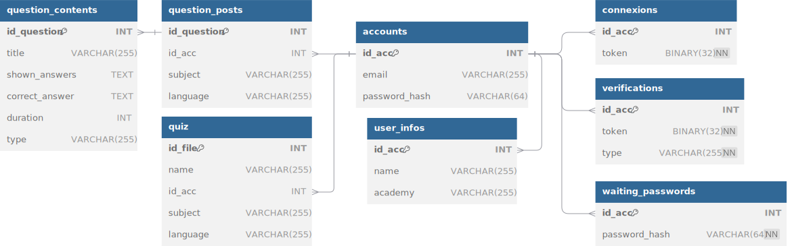

# kahiin-db

Kahiin-DB is a free marketplace for stocking [Kahiin](https://github.com/kahiin-project/kahiin) questions for teachers. This platform allows educators to share and access a wide range of questions to enhance their teaching materials.

## Features

- **Free Access**: Completely free for teachers to use and contribute.
- **Diverse Questions**: A wide variety of questions across different subjects and levels.
- **Community Driven**: Built and maintained by a community of educators.

## Relational Database Schema



## Getting Started

### Supported Operating Systems

- Ubuntu/Debian
- CentOS/RHEL
- Arch Linux

### Installation

1. Clone the repository:
    ```sh
    git clone https://github.com/kahiin-project/kahiin-db.git
    cd kahiin-db
    ```

2. Initialize the database:
    ```sh
    # Ubuntu/Debian
    ./initDB/ubuntu-debian.sh
    
    # CentOS/RHEL
    ./initDB/centos-rhel.sh

    # Arch Linux
    ./initDB/arch.sh
    ```

    The `init` scripts perform the following actions:
    - Updates the package list.
    - Installs MySQL.
    - Cleans up previous MySQL installations.
    - Reinstalls the MySQL server.
    - Starts the MySQL service.
    - Creates a new database and a new MySQL user.

    During the execution of the script, you will be prompted to provide a database name, a username, and a password.

### Running the Application

Start the application with the following command:
```sh
./start.sh
```

The `start` script performs the following actions:
- Sets up the necessary environment variables.
- Starts the application server.
- Ensures that all required services are running.
- Prompts the user to provide MySQL and email configuration details, which are then automatically saved in the config.ini file.

💡 The application uses an email verification system to confirm user registrations. When a new user registers, a verification email is sent to the provided email address (same for reseting password).

Once the application is running, you can access it at `http://localhost:5000` (or the configured port).

### Using the Application

Here are the steps to use the application:
Kahiin-DB provides a RESTful API for programmatic access. Here are some example commands using `curl`:

1. **Register a New User**:
    ```sh
    curl -X POST http://localhost:5000/signup \
    -H "Content-Type: application/json" \
    -d '{
        "email": "your_email@example.com",
        "password_hash": "your_password_hash"
    }'
    ```
    - **email**: Your email address.
    - **password_hash**: The hashed password (SHA256).

2. **Login**:
    ```sh
    curl -X POST http://localhost:5000/login \
    -H "Content-Type: application/json" \
    -d '{
        "email": "your_email@example.com",
        "password_hash": "your_password_hash"
    }'
    ```
    - **email**: Your email address.
    - **password_hash**: The hashed password (SHA256).

    This will return a token (hexadecimal) that you will use for authenticated requests.

3. **Reset Password**
    ```sh
    curl -X POST http://localhost:5000/reset-password \
    -H "Content-Type: application/json" \
    -d '{
        "token": "your_token",
        "new_password_hash": "your_new_password_hash"
    }'
    ```
    - **token**: Your authentication token.
    - **new_password_hash**: The new hashed password (SHA256).

4. **Delete Account**
    ```sh
    curl -X DELETE http://localhost:5000/account \
    -H "Content-Type: application/json" \
    -d '{
        "token": "your_token",
        "password": "your_password"
    }'
    ```
    - **token**: Your authentication token.
    - **password**: Your current password.

---

5. **Search Quizzes**:
    ```sh
    curl -G -d "token=your_token" \
    -d "param1=value1" \
    -d "param2=value2" \
    http://localhost:5000/quiz
    ```
    - **token**: Your authentication token.
    - **params**: Add as much parameters as you want.

6. **Search Questions**:
    ```sh
    curl -G -d "token=your_token" \
    -d "param1=value1" \
    -d "param2=value2" \
    http://localhost:5000/questions
    ```
    - **token**: Your authentication token.
    - **params**: Add as much parameters as you want.

7. **Get Specific Question Content**
    ```sh
    curl -G -d "token=your_token" \
    -d "id_question=1" \
    http://localhost:5000/question-content
    ```
    - **token**: Your authentication token.
    - **id_question**: The ID of the question.

8. **Get all posts by the user based on the provided token**
    ```sh
    curl -G -d "token=YOUR_TOKEN_HERE" \
    http://localhost:5000/myposts
    ```
    - **token**: Your authentication token.

---

8. **Upload a New Quiz**
    ```sh
    curl -X POST http://localhost:5000/quiz \
    -F "token=your_token" \
    -F "filename=quiz.xml" \
    -F "file=@/path/to/quiz.xml"
    ```
    - **token**: Your authentication token.
    - **filename**: The name of the quiz file.
    - **file**: The path to the quiz file.

    💡 Upload a new quiz can be done with an HTML form ! Here's a simple example :
    ```HTML
    <!DOCTYPE html>
    <html lang="en">
    <head>
        <meta charset="UTF-8">
        <meta name="viewport" content="width=device-width, initial-scale=1.0">
        <title>Upload Quiz</title>
    </head>
    <body>
        <h1>Upload Quiz</h1>
        <form action="http://localhost:5000/quiz" method="post" enctype="multipart/form-data">
            <label for="token">Token:</label>
            <input type="text" id="token" name="token" value="" required><br><br>
            
            <label for="filename">Filename:</label>
            <input type="text" id="filename" name="filename" required><br><br>
            
            <label for="file">File:</label>
            <input type="file" id="file" name="file" required><br><br>
            
            <input type="submit" value="Upload">
        </form>
    </body>
    </html>
    ```

9. **Upload a New Question**
    ```sh
    curl -X POST http://localhost:5000/question \
    -H "Content-Type: application/json" \
    -d '{
        "token": "your_token",
        "question": {
            "subject": "Math",
            "language": "English",
            "title": "What is 2+2?",
            "shown_answers": "1,2,3,4",
            "correct_answers": "4",
            "duration": 30,
            "type": "multiple_choice"
        }
    }'
    ```
    - **token**: Your authentication token.
    - **question**: The details of the question.
        - **subject**: The subject of the question.
        - **language**: The language of the question.
        - **title**: The title of the question.
        - **shown_answers**: The possible answers.
        - **correct_answers**: The correct answer(s).
        - **duration**: The time duration for the question.
        - **type**: The type of the question (e.g., multiple_choice).

---

10. **Delete Quiz**
    ```sh
    curl -X DELETE http://localhost:5000/quiz \
    -H "Content-Type: application/json" \
    -d '{
        "token": "your_token",
        "id_file": 1
    }'
    ```
    - **token**: Your authentication token.
    - **id_file**: The ID of the quiz file.

11. **Delete Question**
    ```sh
    curl -X DELETE http://localhost:5000/question \
    -H "Content-Type: application/json" \
    -d '{
        "token": "your_token",
        "id_question": 1
    }'
    ```
    - **token**: Your authentication token.
    - **id_question**: The ID of the question.

---

12. **Download Quiz**
    ```sh
    curl -X GET "http://localhost:5000/download?token=your_token&id_file=1" -o quiz.xml
    ```
    - **token**: Your authentication token.
    - **id_file**: The ID of the quiz file.


### Erase the Database

If you need to erase the database for any reason, you can use the `eraseDB` Python script. This script will delete and recreate all SQL tables.
```sh
python3 eraseDB.py
```
💡 Your IDs will not be erased.

### Removing MySQL

To remove MySQL from your system, you can use the scripts located in the `dropDB` folder. Here are the commands to execute based on your Linux distribution:
```sh
# Ubuntu/Debian
./dropDB/ubuntu-debian.sh

# CentOS/RHEL
./dropDB/centos-rhel.sh

# Arch Linux
./dropDB/arch.sh
```

These scripts will stop the MySQL service, remove the MySQL packages, and delete the associated configuration files.

❗ Run these scripts will not answer any ID and will directly execute everything.

### Troubleshooting

If you encounter any issues, here are some common troubleshooting steps:

- **Restart the Application**:
    ```sh
    ./start.sh
    ```

- **Check MySQL Service**:
    ```sh
    sudo systemctl status mysql
    ```

For further assistance, please contact us in [GitHub issues](https://github.com/kahiin-project/kahiin-db/issues).